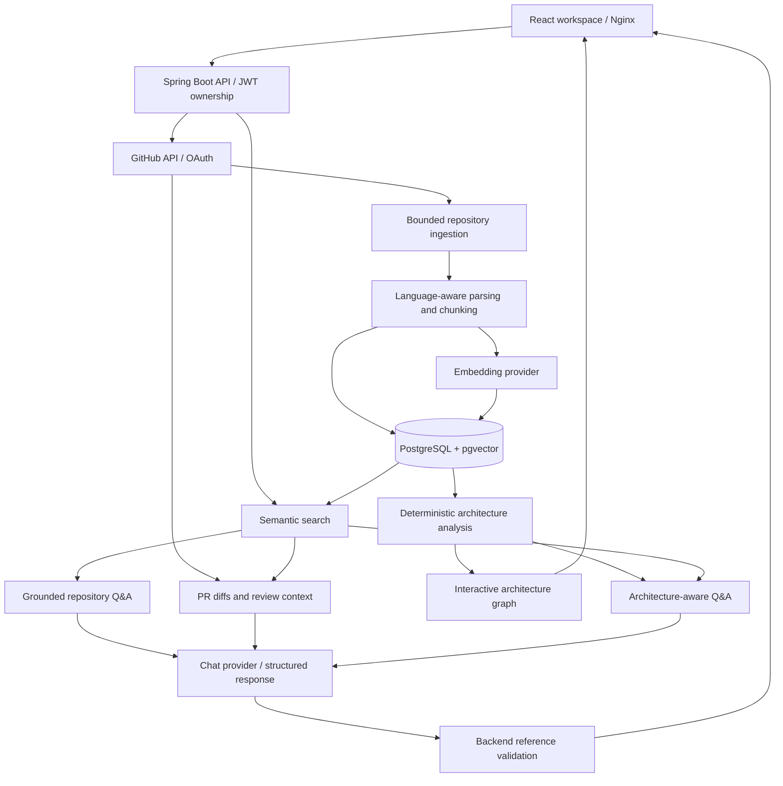

# DevPilot

**AI-Powered Code Intelligence Workspace**

## Overview

DevPilot connects repository source, pull request changes and architecture evidence
in one developer workspace. Connect GitHub, index source code, search by meaning,
ask source-backed questions, review PRs and explore an interactive architecture map.
AI output is an additional engineering signal; validated citations establish its
source references, not the correctness of every conclusion.

## Key Features

- User authentication with BCrypt, JWT access tokens and rotating refresh tokens
- GitHub OAuth and public/private repositories accessible to the connected user
- Async repository ingestion, language-aware parsing and bounded code chunking
- OpenAI-compatible embeddings, PostgreSQL/pgvector semantic code search
- Grounded repository Q&A with validated source IDs and actual file/line references
- Prompt-injection-aware context handling and explicit insufficient-evidence responses
- Staged indexing and atomic publication for safe reindexing
- Read-only AI PR review with normalized diffs and validated diff/source references
- Deterministic architecture extraction and an interactive, searchable dependency graph
- Architecture-aware AI Q&A, Explain Component/Connections and graph-linked citations
- React workspace for repositories, indexing, Ask, Search, PRs and Architecture
- Dockerized full stack and GitHub Actions backend/frontend checks

## Architecture / How It Works



Architecture extraction and graph display work without an LLM. AI explanations
combine the actual graph with bounded source retrieval. PR operations are read-only.

The backend owns authorization and every repository query is scoped to its user.
Files, chunks and embeddings are staged per indexing job, then published together in
one transaction. A failed reindex preserves the previous published snapshot. RAG
requires READY and rejects an index generation change during a request; semantic
retrieval can use a complete prior snapshot during indexing/failure.

Java parsing uses the JDK compiler API **only to parse**, with annotation processing
disabled. Repository code is never compiled or executed. Python and JS/TS use
heuristics; unsupported structures fall back to overlapping line chunks.

## Tech Stack

| Area | Technologies |
| --- | --- |
| Backend | Java 21, Spring Boot 4.1.1, Spring Security, JPA, Flyway, JJWT |
| Data | PostgreSQL 17, pgvector; vector dimensions fixed at 1536 |
| Frontend | React 19, Vite, Axios, React Router; Node 26 for build/CI |
| AI | OpenAI-compatible embedding and chat completion providers; explicit RAG services |
| Infrastructure | Docker Compose, Nginx, GitHub Actions |

## Getting Started — Docker

Clone your published repository URL, then enter its directory:

```sh
git clone <your-devpilot-repository-url> devpilot
cd devpilot
cp .env.example .env
openssl rand -base64 48
```

Set `JWT_SECRET` in `.env` to the newly generated value. The example `change-me` is
intentionally too short for JWT signing. Keep `.env` private; it is ignored by Git
and excluded from Docker build contexts. No GitHub/OpenAI key is needed to start.

```sh
docker compose up --build
```

- Frontend: http://localhost:5174
- API health: http://localhost:8083/api/health
- Same-origin API health: http://localhost:5174/api/health
- PostgreSQL: localhost:5434; local development DB/user/password: `devpilot`

All host ports bind to loopback. Stop existing **DevPilot** manual processes on
5174/8083 before starting Docker, or configure alternative host ports in `.env`.
If changing the frontend port, also update `FRONTEND_BASE_URL`,
`GITHUB_REDIRECT_URI`, `CORS_ALLOWED_ORIGINS` and the GitHub OAuth app callback.
Do not stop unrelated applications to free a port.

Postgres readiness gates the backend; backend health gates Nginx. Flyway applies
migrations on startup and Hibernate validates the schema. The named volume
`devpilot_data` persists data across container replacement. Changing Postgres
credentials in `.env` does not change credentials in an initialized volume: use
an explicit database credential rotation procedure instead. Back up before upgrades.

```sh
docker compose ps
docker compose logs --tail=100 backend
docker compose stop
```

The backend image builds with Java 21/Maven wrapper, then runs as UID 10001 using a
stripped Java runtime that retains `jdk.compiler` for AST parsing. Frontend assets
are built with `npm ci` and served by Nginx. Nginx proxies `/api/` without changing
the path, allows up to 900 seconds for bounded AI review requests and provides SPA history fallback.
It disables access logs to avoid recording OAuth callback query strings.

## Configuration

Copy `.env.example` for the complete list. Compose passes variables explicitly to
the backend; it does not bake secrets into either image. Spring Boot also accepts
these variables directly in the process environment. Vite variables are public,
build-time configuration and must never contain secrets.

| Variable | Requirement / behavior |
| --- | --- |
| `JWT_SECRET` | Required for Docker/deployment; at least 32 random bytes. Manual local dev has a development-only fallback. |
| `SPRING_DATASOURCE_URL` | Docker defaults to `jdbc:postgresql://postgres:5432/devpilot`; manual dev uses localhost:5434. |
| `SPRING_DATASOURCE_USERNAME`, `SPRING_DATASOURCE_PASSWORD` | Local defaults `devpilot`; use your own deployment credentials. |
| `POSTGRES_PORT`, `BACKEND_PORT`, `FRONTEND_PORT` | Compose host ports: 5434, 8083, 5174. |
| `SERVER_PORT` | Manual backend default 8083; Compose explicitly uses internal 8080. |
| `GITHUB_CLIENT_ID`, `GITHUB_CLIENT_SECRET` | Required only for GitHub connection; missing configuration produces an API error. |
| `GITHUB_TOKEN_ENCRYPTION_KEY` | Required for GitHub tokens; base64 of exactly 32 random bytes (`openssl rand -base64 32`). Preserve/back up independently of JWT secret. |
| `GITHUB_REDIRECT_URI` | Docker: `http://localhost:5174/api/github/callback`; manual: `http://localhost:8083/api/github/callback`. Must match the OAuth application. |
| `FRONTEND_BASE_URL` | Trusted frontend origin for OAuth success/failure redirects; default `http://localhost:5174`. |
| `CORS_ALLOWED_ORIGINS` | Explicit comma-separated origin allowlist for manual/cross-origin use. No wildcard credentials. |
| `OPENAI_API_KEY` | Required for embeddings, semantic search, Q&A and AI reviews/explanations; optional at startup. |
| `EMBEDDING_PROVIDER`, `EMBEDDING_BASE_URL`, `EMBEDDING_MODEL` | Defaults: `openai`, `https://api.openai.com/v1`, `text-embedding-3-small`. |
| `EMBEDDING_DIMENSIONS` | Must remain 1536 for the current schema; changing model requires compatible dimensions and reindexing. |
| `EMBEDDING_BATCH_SIZE`, `EMBEDDING_MAX_RETRIES`, `EMBEDDING_RETRY_DELAY_MILLIS` | Defaults: 50, 3, 500; bounded batching/retries. |
| `CHAT_PROVIDER`, `CHAT_BASE_URL`, `CHAT_MODEL` | Defaults: `openai`, `https://api.openai.com/v1`, `gpt-5-mini`; separate chat abstraction. |
| `CHAT_TIMEOUT_SECONDS` | Default 60. |
| `RAG_TOP_K`, `RAG_MAX_CONTEXT_CHARS`, `RAG_MAX_QUESTION_CHARS` | Defaults: 8, 30000, 4000. Compose builds frontend question limit to match. |
| `CHAT_MAX_RETRIES`, `CHAT_RETRY_DELAY_MILLIS` | Shared chat retries: 2 retries, 250 ms incremental delay. |
| `REVIEW_*`, `ARCHITECTURE_*`, `ARCHITECTURE_ASK_*` | Explicit file/graph/context/deadline limits in `.env.example`; see [implementation limits](docs/intelligence.md). |
| `INDEXING_*` | File/total byte/chunk/line/job limits and overlap; every existing knob is listed in `.env.example`. |
| `VITE_API_BASE_URL` | Manual: `http://localhost:8083`. Docker sets `/`; API methods already include `/api`, so `/api` as the base would duplicate it. |
| `VITE_AI_MAX_QUESTION_CHARS` | Manual frontend question bound, default 4000; align with backend and rebuild after changes. |

## GitHub Integration

Register a GitHub OAuth application using the callback for the selected mode.
Docker sends connect and callback requests through the same Nginx origin, preserving
the HttpOnly, SameSite=Lax browser-bound state cookie. The backend validates state
and PKCE, encrypts the token, and redirects browser callbacks to the configured
frontend `/github?connected=true` or `/github?error=oauth_failed`. JSON clients keep
the API response contract. Credentials and callback codes never belong in frontend
configuration. Real OAuth requires a configured application and user authorization.

## Manual development

Use Java 21 and Node 26. First prepare root `.env` as above so Compose can resolve
its configuration, then start only PostgreSQL:

```sh
docker compose up -d postgres
./mvnw spring-boot:run
```

The API runs on http://localhost:8083. Spring does **not** automatically load root
`.env`; export needed variables in the backend shell. Do not export the Docker DB
hostname `postgres` for a host process. Local property defaults use localhost:5434.
Set the manual GitHub callback to http://localhost:8083/api/github/callback.
In another terminal:

```sh
cd frontend
cp .env.example .env
npm ci
npm run dev
```

Open http://localhost:5174. See [frontend/README.md](frontend/README.md) for routes,
auth session behavior, cancellation, source rendering and frontend configuration.

## API overview

Swagger/OpenAPI UI is not included; the route table and linked contracts document
the implemented API.

Protected requests require `Authorization: Bearer <access-token>`.

| Feature | Main endpoints |
| --- | --- |
| Health | `GET /api/health` |
| Auth | `POST /api/auth/register`, `/login`, `/refresh`, `/logout`; `GET /api/users/me` |
| GitHub | `GET /api/github/connect`, `/callback`, `/status`, `/repositories`; `POST /api/github/disconnect` |
| Repositories | `GET/POST /api/repositories`; `GET/DELETE /api/repositories/{id}` |
| Indexing | `POST /api/repositories/{id}/index`; `GET /api/repositories/{id}/index-status` |
| Search | `POST /api/repositories/{id}/search` with `{"query":"JWT validation","limit":8}` |
| Ask | `POST /api/repositories/{id}/ask` with `{"question":"How does JWT authentication work?"}` |

Indexing returns 202; status polling reports the latest attempt separately from the
published snapshot. Search returns real code chunks and similarity (not confidence).
Ask returns answer, only cited source metadata, configured model and `grounded`.
No Swagger UI is included.

## Grounded Repository Q&A

```text
Question -> query embedding -> pgvector cosine search -> ranked whole chunks
 -> bounded source context -> LLM structured completion -> source ID validation
 -> answer with [1] citations and actual path/startLine/endLine metadata
```

RAG reuses the semantic retrieval service. Context separates repository content from
instructions and treats source text as untrusted evidence, including prompt injection
attempts. The provider must use only that evidence and abstain when insufficient.
Every returned statement must cite valid retrieved source IDs. Invalid output is
rejected; only sources cited by the answer are returned. Context is capped and
oversized chunks are skipped rather than silently clipped. `grounded=true` means
citation validation succeeded; it is **not proof of correctness** or a guarantee
against prompt injection. Answers require human review.

## Security

- BCrypt password hashing; JWT access tokens; rotating opaque refresh tokens stored
  only as hashes in the database.
- OAuth state, PKCE and browser binding; AES-256-GCM encryption for stored GitHub tokens.
- Ownership checks on repository/index/search/Ask operations; safe API error messages.
- Secret-file/path ingestion filtering and bounded input sizes. This is not a complete
  content secret scanner: inspect repositories before sending code to external providers.
- Repository chunks are sent to the configured embedding/chat services. Choose a
  provider and data policy appropriate for private source code.
- Frontend renders source/answer text without raw HTML. Access tokens remain in memory;
  refresh tokens use tab-scoped sessionStorage, which is JavaScript-accessible and
  therefore vulnerable to XSS. OAuth state alone uses an HttpOnly cookie.
- Health is public; other non-auth endpoints require authentication except OAuth callback.

The Compose defaults are for a local single-host installation, not an internet-facing
security policy. For public deployment configure HTTPS, trusted origins/callbacks,
strong database/JWT secrets, encrypted backups and operational monitoring. Set an
HTTPS GitHub callback so the state cookie is Secure. Do not expose the database
publicly. Authentication throttling, managed secret rotation and TLS termination are
not provided here. Do not dump resolved Compose environment configuration into logs.

## Testing and CI

Backend integration tests need a disposable PostgreSQL database with pgvector and
migration privileges. Tests create and clean their own fixture users/repositories;
never point a test suite at a production database.

```sh
./mvnw test
cd frontend
npm ci
npm test
npm run lint
npm run build
```

[GitHub Actions CI](.github/workflows/ci.yml) runs on push and pull requests with
separate Java 21 and Node 26 jobs. The backend uses a healthy pgvector/pgvector:pg17
service. External GitHub/OpenAI traffic is replaced by test doubles/deterministic
providers; CI needs no provider credentials. Frontend tests cover auth races,
repository UX and AI workspace behavior. Docker builds skip tests because CI runs
them separately; use both checks before release.

## Version and release

Backend, frontend and Compose image metadata are prepared for **1.1.0**. Existing Flyway V1–V9 migrations are
immutable; schema changes require a new migration. No release/tag is created by
this preparation. Before publication, run CI on GitHub and review deployment settings.
Live GitHub/OpenAI validation is pending until credentials and an indexed repository
are available; deterministic test providers are not proof of live integration.
Choose a license before describing the project as open source. This repository does not currently grant an open-source license.

## Repository Indexing

Indexing runs asynchronously with visible status and safe failure messages. File
filters skip sensitive paths, binaries, generated/vendor content and oversized input.
Java uses parse-only JDK APIs; JS/TS/Python use lightweight symbol extraction, with
line chunk fallback. Files/chunks/embeddings publish atomically from staging.
A failed reindex preserves the prior complete snapshot. No repository code executes.

## Semantic Search

Describe behavior or a concept to retrieve code chunks with real paths, line spans,
language, symbols and similarity. Queries use the configured embedding model and
pgvector; schema dimensions are fixed at 1536. The UI requires a READY repository.
No results is a valid state; rephrase the query or check indexing rather than expect
fabricated matches.

## AI Pull Request Review

Browse open PRs and inspect changed-file diffs with separate old/new line numbers.
For READY repositories, Analyze Pull Request combines bounded diff hunks and semantic
context, then validates model references against actual changed lines and source
chunks. Findings include severity, explanation, recommendation and evidence. Skipped
files and snapshot mismatches remain visible. No comments, reviews, patches or PR
mutations are sent to GitHub.

## Architecture Intelligence

Deterministic source analysis produces real components, directed relationships,
entry points and evidence. Graph and Components views support search, filters,
source locations and detail panels. React Flow is lazy-loaded; Dagre layout runs in
a bounded Web Worker. No architecture embeddings or additional vector tables exist.

## AI Architecture Q&A

Ask a repository-wide question, select a component, or use Explain Component and
Explain Connections. Backend-resolved graph neighborhoods and semantic code chunks
form bounded context. A/E/S citations select actual nodes, relationships and source
locations; Show in graph highlights existing components. Reindex changes invalidate
stale responses. Missing providers return an explicit configuration error, never a
sample answer. All AI questions are single-turn.

Detailed [API contracts, source trust rules, budgets and analysis limitations](docs/intelligence.md)
cover PR and architecture workflows. The [frontend guide](frontend/README.md) describes
UI behavior and graph testing boundaries.

## Limitations

- Live GitHub access needs configured OAuth and user authorization; AI features need
  a configured embedding/chat provider. Local startup works without either.
- Java/Spring architecture extraction is strongest; JS/TS/Python support is lighter.
  Static relationships do not prove runtime call paths. Unresolved edges stay unresolved.
- Large repositories/PRs use explicit budgets and can omit evidence. Warnings describe
  scope. AI review can miss issues; valid citations do not prove every model claim.
- Source filtering and prompt isolation are defense in depth, not complete secret
  detection or a universal prompt-injection defense. Review private code/provider policy.
- Source navigation currently exposes/copies file and line metadata; a full source
  viewer is not implemented. AI history, agents and automatic code changes are absent.
- Local Compose is not a hardened public deployment. See security requirements above.

## Screenshots

No product screenshots are committed yet. This README does not reference placeholder
or nonexistent image files. Screenshots are optional release documentation.

## Roadmap / Future Work

The next step is final validation, CI and v1.1.0 publication after explicit release
authorization. Live external integration validation remains pending. Further product
features are outside this release-polish scope.
